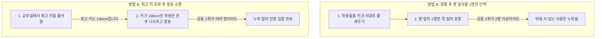

# SQL 최대값 조회 기법 및 데이터 누락 방지 가이드 (프로그래머스 131115번 분석)

본 가이드는 [131115.sql](file:///Users/morgan/Documents/workspace/260711_dql-subquery-join/131115.sql)에 수록된 두 가지 풀이 방식(정렬 후 LIMIT 방식 및 서브쿼리 방식)의 대조를 바탕으로 작성되었습니다. SQLD 자격증 시험 및 기술 면접에서 강조되는 **Top-N 쿼리의 데이터 정합성**과 **서브쿼리 최적화** 원리를 상세히 설명합니다.

---

## 1. 🌟 초심자를 위한 비유: "반에서 키가 제일 큰 학생을 찾는 두 가지 방법"

전체 데이터 중 최대값을 가진 행을 조회할 때 사용하는 두 방식은 **가장 키가 큰 학생을 찾는 다른 접근 방식**과 같습니다.



### 📋 개념 비교 요약
| 구분 | 방법 A: `ORDER BY` + `LIMIT 1` | 방법 B: `WHERE` + 집계 서브쿼리 |
| :--- | :--- | :--- |
| **핵심 기법** | 정렬 후 페이징 컷팅 | 비상관 서브쿼리로 최대값 획득 후 매핑 |
| **비유** | 키 순으로 세워 맨 앞사람만 호명 | 최고 키(190cm)를 알아낸 후 그 키인 사람 모두 방송 소환 |
| **공동 1위 처리**| ❌ **누락 발생** (1명만 출력됨) |  **완벽 지원** (공동 1위 전원 출력됨) |

---

## 2. ⚙️ 주니어를 위한 원리 및 구조 설명

### 🔄 두 방식의 물리적 연산 및 성능 비교

#### 1) 정렬 후 페이징 기법 (`ORDER BY PRICE DESC LIMIT 1`)
[131115.sql:L3-7](file:///Users/morgan/Documents/workspace/260711_dql-subquery-join/131115.sql#L3-7)에 해당하는 방식입니다.
* **작동 방식**: `PRICE` 컬럼을 기준으로 전체 데이터를 내림차순 정렬한 뒤, 가장 첫 번째 로우만 반환합니다.
* **성능 특징**: 
  * 만약 `PRICE` 컬럼에 **인덱스(Index)가 없다면**, DBMS는 전체 데이터를 읽어 임시 공간에서 정렬하는 **Filesort(정렬 연산)**를 수행해야 하므로 리소스 소모가 큽니다.
  * 인덱스가 존재한다면 인덱스 스캔을 타며 극도로 빨라집니다.
* **한계**: 최대 가격을 가진 데이터가 여러 개 존재하더라도 무조건 1개만 반환하므로 데이터 정합성이 깨집니다.

#### 2) 비상관 집계 서브쿼리 기법 (`WHERE PRICE = (SELECT MAX(PRICE) FROM ...)`)
[131115.sql:L14-20](file:///Users/morgan/Documents/workspace/260711_dql-subquery-join/131115.sql#L14-20)에 해당하는 방식입니다.
* **작동 방식**: 서브쿼리가 단독으로 실행되어 테이블 전체의 `MAX(PRICE)`를 단 1회 구해 상수값으로 메인 쿼리에 전달합니다. 이후 메인 쿼리는 이 가격과 일치하는 모든 로우를 조회합니다.
* **성능 특징**:
  * `MAX()` 연산은 인덱스가 있을 경우 인덱스의 가장 마지막 노드값(최대값)만 읽기 때문에 디스크 I/O가 거의 발생하지 않고 상수 수준으로 끝납니다.
* **장점**: 최대값 가격이 동일한 행이 N개 존재할 경우, N개 모두 누락 없이 온전하게 출력하므로 **논리적 정합성**을 완벽하게 만족합니다.

---

## 3. 🎯 SQLD 자격증 대비 핵심 이론

### ⚖️ 집계 함수의 단일 행 특성
`GROUP BY` 절을 지정하지 않고 `MAX()`, `MIN()`, `AVG()` 등의 집계 함수를 단독으로 `SELECT` 절에 사용하면, 결과는 테이블 전체 대상 연산의 결과인 **단 1행 1열의 결과**만을 가집니다.
따라서 이 서브쿼리는 **단일 행 서브쿼리**로 동작하게 되며, 메인 쿼리의 `WHERE` 절에서 다중 행 에러(Subquery returns more than 1 row) 없이 `=`, `>`, `<` 등의 **단일 행 비교 연산자**와 완벽히 호환됩니다.

---

### 🏆 Top-N 쿼리의 정합성 판별
SQLD 시험에서는 동일 순위(공동 1위 등) 처리에 대한 문제가 출제됩니다.
* **정렬 컷팅 방식(`LIMIT 1`, Oracle의 `ROWNUM = 1`)**: 동점자 처리가 불가능합니다.
* **서브쿼리 방식(`col = (SELECT MAX(col)...)`)**: 동점자를 모두 포함합니다.
* **윈도우 함수 방식(`DENSE_RANK()`, `RANK()`)**: 랭킹 기준에 따라 유연하게 조회 가능합니다.

---

## 4. 📝 면접 대비 예상 질문 & 답변 (Q&A)

### Q1. 테이블에서 최대 가격을 가진 상품 정보를 추출할 때, ORDER BY와 LIMIT 1을 쓰는 것과 서브쿼리 MAX를 쓰는 것의 논리적 결과 차이는 무엇인가요?
**A1.**
* `ORDER BY`와 `LIMIT 1` 조합은 테이블 전체에서 정렬 기준 최상위 1개 행만 반환하므로, 만약 동일한 최고 가격을 가진 상품이 여러 개 존재하더라도 무조건 1개만 보여주는 **데이터 누락(정합성 문제)**이 발생합니다.
* 반면, 서브쿼리로 `MAX()` 가격을 먼저 얻어낸 뒤 메인 쿼리의 `WHERE` 절로 비교하는 방식은 최고 가격을 만족하는 **모든 행을 동점자 누락 없이 완벽히 추출**해 냅니다.

---

### Q2. PRICE 컬럼에 인덱스가 없는 상황에서 두 쿼리의 성능 차이는 어떨까요?
**A2.**
* `ORDER BY PRICE DESC LIMIT 1`은 인덱스가 없으면 전체 테이블을 풀 스캔하여 메모리/임시 디스크 공간에서 정렬하는 Filesort 연산을 수행하므로 비용이 많이 듭니다.
* `WHERE PRICE = (SELECT MAX(PRICE) FROM FOOD_PRODUCT)`의 경우도 인덱스가 없으면 서브쿼리가 풀 스캔으로 최대값을 구하고, 메인 쿼리가 다시 풀 스캔을 돌며 조건 비교를 해야 하므로 전체 성능은 좋지 않습니다.
* 다만 인덱스가 추가된다면, 서브쿼리는 인덱스의 가장 우측 노드만 스캔하므로 $O(1)$의 속도로 처리되는 엄청난 튜닝 혜택을 받습니다.

---

### Q3. DBMS에 따라 LIMIT 외에 동일한 페이징 역할을 하는 구문들은 무엇이 있나요?
**A3.**
* **Oracle**: `WHERE ROWNUM <= 1` 또는 12c 버전 이상의 `FETCH FIRST 1 ROWS ONLY`를 사용합니다.
* **SQL Server**: `SELECT TOP 1`을 사용하며, 동점자를 포함하기 위해 `TOP 1 WITH TIES` 구문을 지원하기도 합니다.
* **PostgreSQL / SQLite**: MySQL과 동일하게 `LIMIT 1`을 사용합니다.

---

## 5. 🛠️ 일반화 및 추상화된 최대/최소 조회 템플릿

### 1) 동점자를 포함하여 모든 최대값 행 조회 (정합성 최우선 - 권장)
```sql
SELECT
    m.*
FROM
    [TARGET_TABLE] AS m
WHERE
    m.[COMPARE_COL] = (
        SELECT MAX(s.[COMPARE_COL])
        FROM [TARGET_TABLE] AS s
    ); -- 서브쿼리가 구한 최대값과 매핑되는 모든 행 출력
```

### 2) 인덱스를 통한 고속 1순위 행 조회 (1개만 노출할 때)
```sql
SELECT
    m.*
FROM
    [TARGET_TABLE] AS m
ORDER BY
    m.[COMPARE_COL] DESC -- 내림차순 정렬 (최소값은 ASC)
LIMIT 1; -- 1개 행으로 제한
```
