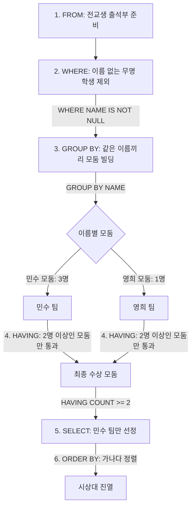

# SQL NULL 연산 및 중복 데이터 집계 가이드 (프로그래머스 59041번 분석)

본 가이드는 [59041.sql](file:///Users/morgan/Documents/workspace/260711_dql-subquery-join/59041.sql)의 쿼리 점진적 구현 과정을 기반으로, SQL의 핵심 개념인 **NULL 비교 논리(`IS NOT NULL`)**, **그룹화 및 빈도수 필터링(`GROUP BY ~ HAVING`)**, 그리고 **`COUNT(*)`와 `COUNT(컬럼)`의 차이**를 상세히 분석합니다.

---

## 1. 🌟 초심자를 위한 비유: "학교 출석부에서 동명이인 모둠 만들기"

SQL에서 중복된 값을 찾고 필터링하는 과정은 **학교 전교생 출석부에서 동명이인(이름이 같은 학생들)을 찾아 별도 모둠을 만드는 과정**과 같습니다.



### 🏫 개념 매핑 표
| SQL 구문 | 출석부 정리 비유 | 설명 |
| :--- | :--- | :--- |
| **`WHERE NAME IS NOT NULL`** | 무명 학생 걸러내기 | 이름 칸이 비어 있는 학생은 중복 여부를 따질 수 없으므로 **분류하기 전에 미리 명단에서 제외**합니다. |
| **`GROUP BY NAME`** | 같은 이름끼리 모아두기 | "민수", "철수", "영희" 등 동일한 이름을 가진 학생들을 각각의 이름 상자(그룹)로 모읍니다. |
| **`HAVING COUNT(*) >= 2`** | 1인 모둠 탈락시키기 | 생성된 모둠 중 구성원 수가 **2명 이상**인 모둠만 통과시키고, 1명인 독고다이 모둠은 탈락시킵니다. |
| **`ORDER BY NAME`** | 가나다 순 줄 세우기 | 최종 선택된 이름들을 가나다(알파벳) 순서대로 정렬하여 출력합니다. |

---

## 2. ⚙️ 주니어를 위한 원리 및 구조 설명

### 🚫 SQL NULL 비교의 비밀: 삼치 논리 (Three-Valued Logic)

[59041.sql:L32](file:///Users/morgan/Documents/workspace/260711_dql-subquery-join/59041.sql#L32)에 명시된 `-- NAME != NULL X` 주석은 SQL 표준에서 가장 중요한 원리 중 하나를 짚고 있습니다.

SQL에서 `NULL`은 **'존재하지 않는 값(Absence of value)'** 혹은 **'알 수 없는 값(Unknown)'**을 의미합니다. 따라서 일반적인 비교 연산자(`=`, `!=`, `<>`, `<`, `>`)로는 `NULL`을 비교할 수 없습니다.

```
NAME = NULL  ➡️ 결과는 TRUE나 FALSE가 아닌 UNKNOWN (비교 불가)
NAME != NULL ➡️ 결과는 TRUE나 FALSE가 아닌 UNKNOWN (비교 불가)
```

SQL 엔진은 `WHERE` 절의 조건 결과가 오직 **`TRUE`**인 행만 필터링하여 통과시킵니다. `UNKNOWN`은 `TRUE`가 아니므로, `NAME != NULL` 조건은 모든 행에 대해 조건이 성립되지 않아 결국 아무 데이터도 반환하지 못하게 됩니다.

> [!IMPORTANT]
> **해결책**
> SQL에서 NULL 상태를 올바르게 판별하려면 오직 전용 연산자인 **`IS NULL`** 또는 **`IS NOT NULL`**만 사용해야 합니다.

---

### 📊 SQL 논리 진리표 (Three-Valued Logic Truth Table)

SQLD 시험에 단골로 출제되는 3가지 상태값(`TRUE`, `FALSE`, `UNKNOWN`)의 연산 논리표입니다.

| 연산식 | TRUE | FALSE | UNKNOWN (NULL) |
| :--- | :---: | :---: | :---: |
| **AND** | `TRUE` AND **U** ➡️ **U** | `FALSE` AND **U** ➡️ **FALSE** | **U** AND **U** ➡️ **U** |
| **OR**  | `TRUE` OR **U** ➡️ **TRUE** | `FALSE` OR **U** ➡️ **U** | **U** OR **U** ➡️ **U** |
| **NOT** | NOT `TRUE` ➡️ `FALSE` | NOT `FALSE` ➡️ `TRUE` | NOT **U** ➡️ **U** |

* `AND` 연산은 하나라도 `FALSE`면 결과가 `FALSE`가 되지만, `UNKNOWN`과 `TRUE`가 만나면 여전히 `UNKNOWN`입니다.
* `OR` 연산은 하나라도 `TRUE`면 결과가 `TRUE`가 되므로, `TRUE OR UNKNOWN`은 `TRUE`로 평가됩니다.

---

### 🆚 COUNT(*) vs COUNT(column_name)

이 문제 풀이에서 `COUNT(*)`와 `COUNT(NAME)`은 실행 결과가 동일합니다. 그 이유는 앞선 `WHERE` 절에서 이미 `NAME`이 `NULL`인 행을 모조리 제거했기 때문입니다. 하지만 두 연산은 내부적으로 큰 차이가 있습니다.

* **`COUNT(*)`**: 테이블의 **행(Row)의 개수** 자체를 셉니다. 특정 컬럼의 값이 `NULL`이든 아니든 상관없이 카운트합니다.
* **`COUNT(column_name)`**: 해당 컬럼의 값이 **`NULL`이 아닌 행의 개수만** 셉니다. 값이 `NULL`인 행은 카운트 대상에서 제외합니다.

---

## 3. 🎯 SQLD 자격증 대비 핵심 이론

### ⚖️ HAVING 절의 집계 필터 대원칙
- `WHERE` 절은 `GROUP BY`가 실행되기 전에 각 개별 행을 필터링하므로, 그룹 전체 정보가 없어 **집계 함수(`SUM`, `AVG`, `COUNT` 등)를 WHERE 절에 배치할 수 없습니다.**
- 그룹을 지은 결과물(통계값)에 조건 필터를 걸고 싶다면, 반드시 `GROUP BY` 뒤에 오는 **`HAVING` 절**을 사용해야 합니다.

---

## 4. 📝 면접 대비 예상 질문 & 답변 (Q&A)

### Q1. SQL에서 NULL 값의 의미와, 이를 `=` 나 `!=`로 비교할 수 없는 이유에 대해 설명해 주세요.
**A1.**
SQL에서 `NULL`은 값이 0이거나 빈 문자열(`""`)인 상태가 아니라, **'아직 정의되지 않았거나 알 수 없는 값(Unknown)'**을 나타냅니다. 
따라서 `NULL = NULL`이나 `NULL != NULL` 같은 비교 연산의 결과는 참 혹은 거짓이 아닌 `UNKNOWN`이 됩니다. SQL의 `WHERE` 절은 오직 평가 결과가 `TRUE`인 데이터만 필터링하여 통과시키기 때문에, `UNKNOWN`으로 평가되는 일반 비교 연산자로는 NULL 값을 올바르게 찾아낼 수 없습니다. 대신 `IS NULL`이나 `IS NOT NULL`이라는 특수 연산자를 사용해야 합니다.

---

### Q2. 표준 SQL 표준과 비교했을 때, MySQL의 HAVING 절에서 가질 수 있는 독특한 이점은 무엇인가요?
**A2.**
표준 SQL 규칙에 따르면 `HAVING` 절은 `SELECT` 절보다 먼저 실행되므로 `SELECT` 절에서 지정한 Alias(별칭)를 `HAVING` 절에서 활용할 수 없습니다. 
그러나 **MySQL(및 MariaDB)**은 이를 독자적으로 확장 지원하여, **`SELECT` 절에 선언한 Alias를 `HAVING` 절에서도 사용 가능**하게 설계되었습니다. 이를 통해 쿼리의 중복 코드를 줄이고 가독성을 높일 수 있습니다.

---

### Q3. COUNT(NAME)과 COUNT(*)의 차이점은 무엇인가요?
**A3.**
`COUNT(*)`은 행에 담긴 데이터 내용에 상관없이 행의 총개수를 반환하며, 테이블 내의 모든 열 값을 확인하여 NULL 행까지 포함해 카운트합니다. 
반면 `COUNT(NAME)`은 `NAME` 컬럼에 들어있는 값 중 `NULL`이 아닌 실제 값만을 카운트하여 반환하므로, 컬럼 내 NULL 데이터의 존재 유무에 따라 두 결과값이 다르게 도출될 수 있습니다.

---

## 5. 🛠️ 일반화 및 추상화된 중복 검사 DQL 템플릿

특정 테이블 구조에 제한받지 않고, 특정 기준 속성의 중복 데이터 빈도를 추출하기 위한 표준 템플릿입니다.

```sql
-- 중복 값 검출 및 정렬 템플릿
SELECT
    [DUPLICATE_KEY_COLUMN] AS group_key,
    COUNT(*)               AS occurrence_count    -- 중복 발생 횟수 집계
FROM
    [TARGET_TABLE]
WHERE
    [DUPLICATE_KEY_COLUMN] IS NOT NULL           -- NULL 값은 집계 대상에서 원천 배제
GROUP BY
    [DUPLICATE_KEY_COLUMN]                       -- 기준 컬럼 그룹화
HAVING
    COUNT(*) >= [MIN_THRESHOLD]                  -- 설정한 최소 중복 횟수(N회) 이상인 그룹만 선택
ORDER BY
    occurrence_count DESC,                       -- 빈도수가 높은 것부터 우선 정렬
    group_key ASC;                               -- 빈도수가 같다면 키값 사전순 정렬
```
