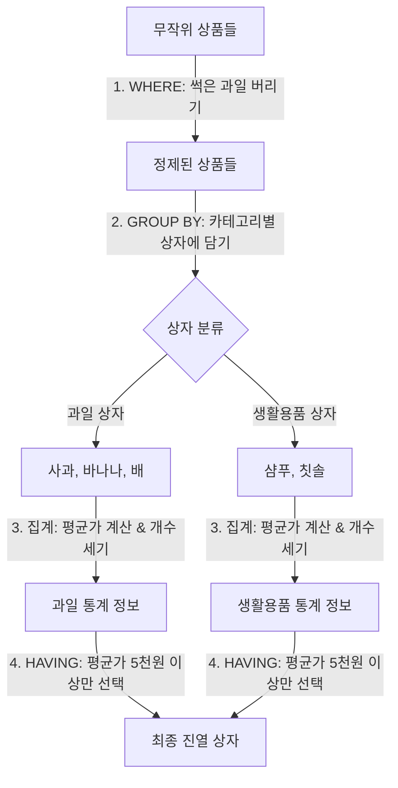
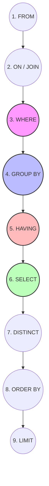

# MySQL DQL 그룹화 및 집계 가이드 (GROUP BY & HAVING)

본 가이드는 [dql01.sql](file:///Users/morgan/Documents/workspace/260711_dql-subquery-join/dql01.sql) 소스 코드 분석을 바탕으로, MySQL 환경에서의 데이터 그룹화(`GROUP BY`)와 그룹 필터링(`HAVING`), 그리고 집계 함수의 작동 원리를 다룹니다. 초심자부터 주니어 개발자, 그리고 SQLD(SQL 개발자) 자격증을 준비하는 분들까지 쉽게 이해할 수 있도록 구성되었습니다.

---

## 1. 🌟 초심자를 위한 비유: "마트 상품 정리와 상자 분류"

SQL의 그룹화와 집계는 **대형 마트에서 상품을 정리하고 통계를 내는 과정**과 완전히 똑같습니다.



### 📦 개념 매핑 표
| SQL 문법 | 마트 정리 비유 | 설명 |
| :--- | :--- | :--- |
| **FROM** | 창고 개방 | 데이터를 가져올 대상 테이블을 지정합니다. |
| **WHERE** | 개별 상품 검수 (상자에 넣기 전) | 분류 상자에 넣기 전에 쓸모없는 개별 상품(예: 불량품, 가격이 너무 낮은 상품)을 미리 걸러냅니다. |
| **GROUP BY** | 카테고리 상자에 담기 | 상품들을 '과일', '생활용품', '전자제품' 등 카테고리(그룹 기준 컬럼)별 상자에 나누어 담습니다. |
| **집계 함수 (SUM, AVG 등)** | 상자 안의 통계 계산 | 각 상자 내부에 담긴 상품들의 개수를 세거나(`COUNT`), 평균 가격을 계산합니다(`AVG`). |
| **HAVING** | 분류된 상자 필터링 (상자에 넣은 후) | 통계 계산이 완료된 상자들 중에서 특정 조건(예: "평균 가격이 10만 원을 넘는 상자")을 만족하는 상자만 골라냅니다. |
| **SELECT** | 매대 진열 및 가격표 부착 | 최종적으로 통계 결과(카테고리명, 총 개수, 평균 가격 등)를 화면에 출력합니다. |

---

## 2. ⚙️ 주니어를 위한 원리 및 구조 설명

### 🔄 논리적 쿼리 실행 순서 (Logical Query Processing Order)

개발자가 코드를 작성하는 순서(Syntactic Order)와 MySQL 엔진이 실제로 쿼리를 실행하는 순서(Logical Order)는 다릅니다. 이 차이를 아는 것이 성능 최적화와 오류 디버깅의 시작입니다.



1. **`FROM` / `JOIN`**: 조회할 대상 테이블과 조인 조건을 먼저 확인하여 데이터셋을 메모리에 로드합니다.
2. **`WHERE`**: 그룹화가 일어나기 전, 개별 행(Row)을 검사하여 조건에 맞지 않는 데이터를 필터링합니다. (인덱스가 있다면 이때 활용됩니다.)
3. **`GROUP BY`**: 남은 데이터를 지정된 기준 컬럼 값에 따라 임시 테이블이나 버킷에 그룹화합니다.
4. **`HAVING`**: 그룹화된 결과 및 집계 함수 결과를 기준으로 그룹(Group) 자체를 필터링합니다.
5. **`SELECT`**: 출력할 컬럼들을 결정하고, 이 시점에서야 비로소 컬럼의 별칭(Alias)이 정의됩니다.
6. **`DISTINCT`**: 중복 행을 제거합니다.
7. **`ORDER BY`**: 최종 결과를 정렬합니다. `SELECT` 절에서 정의된 Alias를 사용할 수 있습니다.
8. **`LIMIT`**: 최종 출력할 행의 개수를 제한합니다.

---

### 🚨 Invalid use of group function (Error 1111) 원리 분석

[dql01.sql:L39-41](file:///Users/morgan/Documents/workspace/260711_dql-subquery-join/dql01.sql#L39-41)에서 발생하는 대표적인 에러입니다.

```sql
-- [에러 발생 쿼리]
SELECT category, AVG(price) 
FROM products 
WHERE AVG(price) > 100000 -- ❌ 에러 발생! (SQL Error 1111)
GROUP BY category;
```

#### 💡 원리 설명:
1. `WHERE` 절은 `GROUP BY` 절보다 **먼저** 실행됩니다.
2. 이 단계에서는 테이블 전체 데이터가 아직 카테고리별로 묶이지 않았고, 개별 행 상태로 존재합니다.
3. 따라서 그룹 전체의 평균을 계산하는 **집계 함수(`AVG`)는 이 시점에 값 자체가 존재하지 않아 연산할 수 없습니다.**
4. 집계 결과에 기반한 필터 조건은 반드시 그룹화가 완료된 시점 이후에 실행되는 **`HAVING` 절**에 작성해야 합니다.

---

## 3. 🎯 SQLD 자격증 대비 핵심 이론

### 📊 집계 함수와 NULL의 특별한 관계

SQLD 자격증 시험에서 매우 높은 빈도로 출제되는 단골 유형입니다. **집계 함수는 NULL 값을 어떻게 처리하는지** 정확히 숙지해야 합니다.

| 함수 | NULL 처리 방식 | 예시 상황 (값: 10, 20, NULL) | 결과 |
| :--- | :--- | :--- | :--- |
| **`COUNT(*)`** | **NULL 포함**하여 모든 행의 개수를 세어줌. | `COUNT(*)` | 3 |
| **`COUNT(컬럼)`**| NULL 값을 가진 행을 **제외**하고 세어줌. | `COUNT(val)` | 2 |
| **`SUM(컬럼)`**  | NULL 값을 제외하고 합계를 구함. | `SUM(val)` | 30 |
| **`AVG(컬럼)`**  | NULL 값을 제외한 데이터 수로 나눔. (즉, 분모는 `COUNT(컬럼)`이 됨) | `AVG(val)` | 15 (30 / 2) |

> [!WARNING]
> **자주 출제되는 함정**
> `AVG(val)`은 `SUM(val) / COUNT(val)`과 동일합니다.
> 절대 전체 행 개수인 `SUM(val) / COUNT(*)`이 아닙니다. NULL 데이터를 사전에 0으로 대체하여 평균 계산에 참여시키려면 `COALESCE`나 `IFNULL`을 사용하여 `AVG(COALESCE(val, 0))` 형태로 작성해야 합니다.

---

### 🆚 DISTINCT vs GROUP BY

두 문법 모두 중복을 제거한 고유값을 보여주는 용도로 사용될 수 있지만, 본질적인 쓰임새와 구조가 다릅니다.

- **`DISTINCT`**
  - **목적**: 단순히 조회 대상 데이터의 중복 행을 제거하여 유일한(Unique) 조합만 출력합니다.
  - **특징**: 내부적인 집계 연산(합계, 평균 등)을 동반하지 않습니다.
- **`GROUP BY`**
  - **목적**: 데이터를 특정 컬럼 기준으로 그룹화하여 **그룹별 집계 데이터**를 연산합니다.
  - **특징**: 정렬(Ordering)이나 집계 함수와 함께 동작하는 경우가 많습니다.

---

### ⚠️ ONLY_FULL_GROUP_BY 제약 조건

`GROUP BY`를 사용할 때 `SELECT` 절에 올 수 있는 컬럼에는 엄격한 규칙이 있습니다.

- **정답**: `GROUP BY`에 지정한 컬럼명 또는 `COUNT()`, `SUM()`, `AVG()` 등의 집계 함수만 `SELECT` 절에 사용 가능합니다.
- **오답**: 그룹화 기준 외의 개별 컬럼(예: 그룹 내 상품들의 각기 다른 상품명)을 그대로 `SELECT`에 적으면 안 됩니다. (MySQL 5.7+ 및 표준 SQL 표준 규격인 `ONLY_FULL_GROUP_BY` 모드가 켜져 있을 때 에러 발생)

---

## 4. 📝 면접 대비 예상 질문 & 답변 (Q&A)

### Q1. WHERE 절과 HAVING 절의 결정적인 차이는 무엇인가요?
**A1.**
두 절 모두 데이터를 필터링하는 조건절이지만, **필터링을 수행하는 시점과 대상**이 다릅니다.
- **`WHERE`**: 데이터가 그룹화되기 전에 개별 행(Row) 단위로 필터링을 수행하며, 집계 함수(`SUM`, `AVG`, `COUNT` 등)를 사용할 수 없습니다.
- **`HAVING`**: 데이터가 `GROUP BY`에 의해 그룹화된 이후에 그룹(Group) 단위를 대상으로 필터링을 수행하며, 집계 함수의 결과를 조건식으로 사용할 수 있습니다.

---

### Q2. SQL의 논리적 실행 순서를 설명하고, 왜 SELECT 절의 Alias(별칭)를 WHERE 절에서 사용할 수 없는지 설명해 주세요.
**A2.**
SQL의 실행 순서는 `FROM` ➡️ `WHERE` ➡️ `GROUP BY` ➡️ `HAVING` ➡️ `SELECT` ➡️ `ORDER BY` 순입니다.
`WHERE` 절은 `SELECT` 절보다 먼저 실행되기 때문에, `SELECT` 절에서 지정한 Alias(별칭)를 아직 인지하지 못합니다. 반면, `ORDER BY` 절은 `SELECT` 절보다 나중에 실행되므로 `SELECT`에서 선언한 Alias를 자유롭게 활용할 수 있습니다.

---

### Q3. COUNT(*)와 COUNT(컬럼명)의 결과가 달라질 수 있는 상황을 설명해 주세요.
**A3.**
해당 컬럼에 `NULL` 값이 존재할 때 두 결과가 달라집니다.
`COUNT(*)`은 데이터의 유무와 상관없이 테이블 내의 모든 행의 수를 리턴하는 반면, `COUNT(컬럼명)`은 지정된 컬럼의 값이 `NULL`이 아닌 데이터만 카운트하기 때문입니다.

---

## 5. 🛠️ 일반화 및 추상화된 DQL 템플릿

특정 도메인에 얽매이지 않고 활용할 수 있도록 표준화한 템플릿 코드입니다.

```sql
-- DQL 기본 템플릿: 그룹화 및 필터링
SELECT
    [GROUP_BY_COLUMN] AS group_key,
    COUNT(*)          AS total_row_count,        -- NULL을 포함한 행 개수
    COUNT([COL_A])    AS non_null_count,        -- NULL을 제외한 행 개수
    SUM([COL_B])      AS total_sum,             -- NULL을 제외한 합계
    AVG([COL_B])      AS average_value          -- (SUM / non_null_count) 형태의 평균값
FROM
    [TABLE_NAME]
WHERE
    [COL_C] = 'FILTER_VALUE'                    -- 그룹화 전 개별 행에 대한 필터링 조건
GROUP BY
    [GROUP_BY_COLUMN]
HAVING
    AVG([COL_B]) > 50000                        -- 그룹화 및 집계 완료 후, 집계 결과 필터링 조건
ORDER BY
    average_value DESC                          -- SELECT 절의 Alias 활용한 정렬
LIMIT 10;                                       -- 최종 결과 중 상위 10개 행만 추출
```
