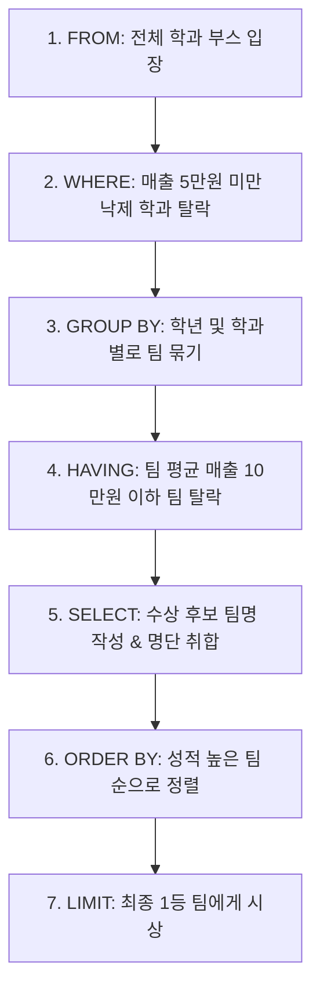

# MySQL DQL 7단계 실행 순서 및 다중 그룹화 가이드 (DQL Deep Dive)

본 가이드는 [dpl02.sql](file:///Users/morgan/Documents/workspace/260711_dql-subquery-join/dpl02.sql) 소스 코드 분석을 바탕으로, MySQL 환경에서 SQL 문법의 **7단계 논리적 실행 순서**, **다중 컬럼 그룹화**, **GROUP_CONCAT 함수**, 그리고 **ORDER BY/LIMIT 제약조건**에 대해 상세히 다룹니다.

---

## 1. 🌟 초심자를 위한 비유: "학교 축제 우수 학과 시상식"

SQL DQL의 7단계 실행 메커니즘은 **학교 축제에서 여러 학과들의 부스 매출을 집계하여 우수 학과를 선정하고 시상하는 과정**과 매우 흡사합니다.



### 🏫 개념 매핑 표
| 단계 | SQL 예약어 | 축제 시상식 비유 | 설명 |
| :---: | :--- | :--- | :--- |
| **1** | **FROM / JOIN** | 전체 학과 부스 참가 | 데이터를 조회할 기본 테이블(또는 조인된 테이블 테이블셋)을 가져옵니다. |
| **2** | **WHERE** | 1차 컷탈락 (개별 부스) | 단일 부스 단위로 매출이 너무 저조한 곳들을 미리 명단에서 제외시킵니다. |
| **3** | **GROUP BY** | 학년/학과별 팀 빌딩 | 남은 부스들을 '학년'과 '학과'라는 2가지 기준(다중 그룹)으로 묶어 하나의 팀으로 만듭니다. |
| **4** | **HAVING** | 2차 컷탈락 (팀 단위) | 묶인 팀 단위의 평균 매출을 계산하여, 기준 점수를 못 넘긴 **팀 전체**를 탈락시킵니다. |
| **5** | **SELECT** | 상장 작성 및 명단 나열 | 최종 진열할 컬럼을 고르고, 팀원들의 이름을 한 줄에 모아 적는 작업(`GROUP_CONCAT`)을 수행합니다. |
| **6** | **ORDER BY** | 수상 후보 정렬 | 선정된 우수 팀들을 성적 순서대로 정렬하여 무대 뒤에 세웁니다. |
| **7** | **LIMIT** | 대상 시상 (개수 제한) | 가장 성적이 좋은 상위 1개 팀(`LIMIT 1`)만 무대 위로 불러 대상을 시상합니다. |

---

## 2. ⚙️ 주니어를 위한 원리 및 구조 설명

### 🔄 7단계 논리적 실행 순서와 데이터 변화 흐름

개발자가 코드를 작성하는 순서(구문 순서)와 데이터베이스 엔진이 내부적으로 데이터를 처리하는 순서(논리적 실행 순서)의 불일치는 SQL 성능 분석의 핵심입니다.

```
[구문 작성 순서 (Syntactic Order)]
SELECT -> FROM -> WHERE -> GROUP BY -> HAVING -> ORDER BY -> LIMIT

[논리적 실행 순서 (Logical Processing Order)]
FROM ➡️ WHERE ➡️ GROUP BY ➡️ HAVING ➡️ SELECT ➡️ ORDER BY ➡️ LIMIT
```

#### 📊 각 단계별 데이터 메모리 레이아웃 변화

```mermaid
grid
  title DQL 데이터 변환 파이프라인
  
  %% 1단계
  FROM["1. FROM / JOIN\n[전체 원본 데이터 로드]"]
  --> WHERE["2. WHERE\n[개별 행 필터링\n인덱스 활용 구간]"]
  
  %% 2단계
  WHERE --> GROUP["3. GROUP BY\n[지정 컬럼 기준 버킷 생성\n데이터의 1차 압축]"]
  --> HAVING["4. HAVING\n[그룹화된 버킷 필터링\n집계값 조건 검사]"]
  
  %% 3단계
  HAVING --> SELECT["5. SELECT\n[원하는 열 추출\nGROUP_CONCAT 실행]"]
  --> ORDER["6. ORDER BY\n[최종 결과 정렬\nAlias 사용 가능]"]
  
  %% 4단계
  ORDER --> LIMIT["7. LIMIT\n[결과 행 수 제한]"]
```

---

### 🔗 GROUP_CONCAT()의 동작 원리
[dpl02.sql:L71-85](file:///Users/morgan/Documents/workspace/260711_dql-subquery-join/dpl02.sql#L71-85)에 나오는 `GROUP_CONCAT`은 MySQL의 매우 강력한 그룹 집계 함수입니다.

- **역할**: 그룹화된 여러 행의 특정 컬럼 값들을 하나의 문자열로 결합(Concatenate)합니다.
- **동작 방식**: 
  1. `GROUP BY`에 의해 그룹화된 내부 버킷을 순회합니다.
  2. 지정된 컬럼의 값들을 순서대로 읽습니다.
  3. 기본 구분자(콤마 `,`) 또는 지정한 구분자(Separator)로 연결하여 하나의 문자열 행으로 병합합니다.
- **일반형태**: `GROUP_CONCAT([컬럼명] ORDER BY [정렬컬럼] SEPARATOR '[구분자]')`

---

### 👥 다중 그룹화(Multi-Column GROUP BY)의 메커니즘
[dpl02.sql:L130-135](file:///Users/morgan/Documents/workspace/260711_dql-subquery-join/dpl02.sql#L130-135)처럼 `GROUP BY A, B`로 작성하는 형태입니다.

1. DB 엔진은 먼저 첫 번째 컬럼 `A`를 기준으로 대그룹을 분류합니다.
2. 분류된 대그룹 안에서 두 번째 컬럼 `B`를 기준으로 소그룹(서브그룹)을 분할합니다.
3. 최종적으로 **(A, B)의 고유값 쌍(Pair)**이 하나의 고유 그룹 식별자가 됩니다.
4. 만약 `sale_date`에 3개 종류가 있고, `product_id`에 4개 종류가 있다면, 이론상 최대 $3 \times 4 = 12$개의 그룹 버킷이 생성됩니다.

---

## 3. 🎯 SQLD 자격증 대비 핵심 이론

### 🚫 GROUP BY와 ORDER BY의 제약 관계
[dpl02.sql:L105-106](file:///Users/morgan/Documents/workspace/260711_dql-subquery-join/dpl02.sql#L105-106)에서 설명하는 제약 조건은 SQLD 자격증 단골 함정 문제입니다.

> [!IMPORTANT]
> **GROUP BY 적용 시 ORDER BY에 올 수 있는 컬럼 제약**
> `GROUP BY`로 데이터가 압축된 상태라면, `ORDER BY` 절에는 오직 다음 두 종류만 올 수 있습니다.
> 1. `GROUP BY`에 사용된 **기준 컬럼**
> 2. `SUM()`, `AVG()` 등의 **집계 함수** (또는 집계 함수의 Alias)
> 
> 만약 `GROUP BY category`를 해놓고 `ORDER BY price`를 하게 되면, 한 카테고리 내에 존재하는 수많은 상품들의 `price` 중 **어떤 개별 행의 가격을 기준으로 정렬해야 할지 판단할 수 없으므로** SQL Syntax 에러가 발생합니다.

---

### 📊 LIMIT vs ROWNUM (DBMS별 페이징 기법 비교)
DQL의 마지막 단계를 장식하는 페이징(Paging) 처리는 시험과 실무에서 빈번히 출제됩니다.

| DBMS | 문법 | 예시 코드 | 특징 |
| :--- | :--- | :--- | :--- |
| **MySQL / MariaDB** | **`LIMIT`** | `LIMIT 10 OFFSET 20` | 가독성이 매우 좋으며 직관적임. |
| **Oracle** | **`ROWNUM` / `ROW_NUMBER()`** | `WHERE ROWNUM <= 10` | Inline View를 활용해야 정확한 정렬 후 페이징이 가능함. |
| **SQL Server** | **`TOP` / `OFFSET FETCH`** | `ORDER BY col OFFSET 20 ROWS FETCH NEXT 10 ROWS ONLY` | 표준 SQL 형식을 따름. |

---

## 4. 📝 면접 대비 예상 질문 & 답변 (Q&A)

### Q1. ORDER BY 절에서 SELECT 절의 Alias(별칭)를 사용할 수 있는 이유와, WHERE/GROUP BY 절에서는 사용할 수 없는 이유를 설명해 주세요.
**A1.**
SQL의 논리적 실행 순서 때문입니다. 
`WHERE`와 `GROUP BY` 절은 `SELECT` 절보다 먼저 실행되기 때문에 `SELECT`에서 정의한 Alias를 인지할 수 없습니다. 반면, `ORDER BY` 절은 `SELECT` 절이 처리된 **이후**에 실행되므로 `SELECT` 절에서 선언한 Alias를 안전하게 참조하여 정렬 기준으로 삼을 수 있습니다.

---

### Q2. MySQL에서 GROUP_CONCAT 사용 시 발생할 수 있는 잠재적인 리스크와 이를 해결하는 방법을 알고 계신가요?
**A2.**
`GROUP_CONCAT`은 결과를 메모리 상에서 합치기 때문에 문자열의 최대 길이에 제한이 있습니다. 
MySQL의 기본 제한 길이는 **1,024 바이트**입니다. 만약 그룹 내 데이터가 많아 이 제한을 초과하면 데이터가 유실되거나 잘린 채(`Truncated`) 출력됩니다.
이를 해결하려면 MySQL 시스템 변수인 `group_concat_max_len`을 세션 또는 글로벌 단위로 확장해주어야 합니다.
```sql
SET SESSION group_concat_max_len = 1048576; -- 1MB로 확장
```

---

### Q3. 다중 컬럼 GROUP BY(예: `GROUP BY A, B`)를 적용했을 때의 내부 연산 과정과 결과 행 수에 대해 설명해 주세요.
**A3.**
다중 컬럼 GROUP BY는 `A` 컬럼과 `B` 컬럼의 유니크한 조합을 하나의 그룹으로 형성합니다.
데이터베이스 엔진은 데이터를 스캔하면서 `(A, B)`의 복합 키 값을 추출하여 해시 맵(Hash Map)에 매핑하거나 정렬을 통해 그룹화합니다. 결과 행의 개수는 `A` 컬럼의 고유값 수와 `B` 컬럼의 고유값 수의 곱 이하가 되며, 데이터 내에 실제로 존재하는 `(A, B)` 유니크 조합의 총 개수와 일치하게 됩니다.

---

## 5. 🛠️ 일반화 및 추상화된 DQL 템플릿

7단계 전체 흐름과 다중 그룹화, 그리고 문자열 결합 기능까지 모두 녹여낸 범용 DQL 템플릿입니다.

```sql
-- DQL 종합 마스터 템플릿 (MySQL 기준)
SELECT
    [GROUP_COL_A]                      AS primary_group,
    [GROUP_COL_B]                      AS secondary_group,
    COUNT(*)                           AS total_count,
    SUM([VAL_COL])                     AS sum_value,
    AVG([VAL_COL])                     AS avg_value,
    -- 그룹 내 문자열 데이터를 오름차순 정렬 후 세미콜론(;)으로 연결
    GROUP_CONCAT(
        [STR_COL] 
        ORDER BY [STR_COL] ASC 
        SEPARATOR ';'
    )                                  AS concatenated_details
FROM
    [TABLE_A] AS a
INNER JOIN
    [TABLE_B] AS b ON a.[KEY_A] = b.[KEY_B]
WHERE
    a.[FILTER_COL] >= 10000            -- 1단계 필터링 (개별 행 수준)
GROUP BY
    [GROUP_COL_A],
    [GROUP_COL_B]                      -- 다중 컬럼 그룹화
HAVING
    AVG([VAL_COL]) > 50000             -- 2단계 필터링 (그룹 통계 수준)
ORDER BY
    avg_value DESC,                    -- SELECT Alias 활용 정렬
    primary_group ASC                  -- 그룹 컬럼 정렬
LIMIT 5 OFFSET 0;                      -- 페이징 처리 (상위 5개 행만 조회)
```
