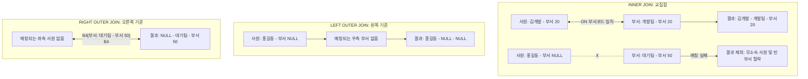
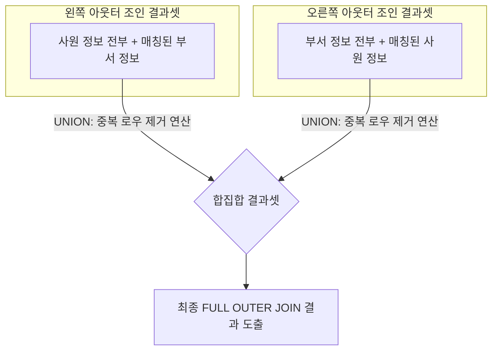

# MySQL DQL 조인(JOIN) 및 집합 연산 마스터 가이드

본 가이드는 [join01.sql](file:///Users/morgan/Documents/workspace/260711_dql-subquery-join/join01.sql)의 조인 제어 코드를 바탕으로 작성되었습니다. SQLD 자격증 취득 및 실무 쿼리 최적화를 위해 **DDL 및 테스트 데이터 생성 단계를 제외**하고, DQL(Data Query Language) 관점에서 **조인의 유형별 물리적 동작**, **조인 조건절(`ON` / `USING`)의 제약**, **`UNION` 연산자의 메커니즘**을 규명합니다.

---

## 1. 🌟 초심자를 위한 비유: "사원 수첩과 부서 안내서 합치기"

서로 다른 정보를 가진 두 테이블을 조인하는 과정은 **사원 신상 정보가 적힌 수첩(사원 테이블)과 부서 위치가 적힌 안내서(부서 테이블)를 결합하여 한 장의 보고서를 만드는 것**과 같습니다.



### 📦 개념 매핑 표
| 조인 방식 | 비유 설명 | 결과물 특징 |
| :--- | :--- | :--- |
| **`INNER JOIN`** | 부서에 정식 소속된 사원들과 사원이 소속된 부서 정보만 매칭해 합치기 | 양쪽 모두 정보가 존재하는 교집합 데이터만 조회 (무소속 사원 및 빈 부서 제외). |
| **`LEFT JOIN`** | 사원 명단을 1번부터 끝까지 적고, 각 사원의 소속 부서 정보를 옆에 붙여 적기 | 사원 정보는 무조건 100% 출력되며, 부서가 없는 사원의 부서 정보는 `NULL`로 채워짐. |
| **`RIGHT JOIN`** | 부서 리스트를 판교, 서울, 대전 순으로 적고, 소속된 사원명을 옆에 붙여 적기 | 부서 정보는 무조건 100% 출력되며, 사원이 한 명도 없는 신설 부서의 사원 정보는 `NULL`로 채워짐. |
| **`UNION`** | 두 보고서 문서를 아래로 풀칠해 하나의 문서로 이어붙이기 | 중복된 항목은 깔끔하게 지우고 하나만 남기는 합집합 연산. |

---

## 2. ⚙️ 주니어를 위한 원리 및 구조 설명

### 🔄 조인 조건절 3대장 (`WHERE` vs `ON` vs `USING`) 정밀 비교

조인 시 사용하는 조건식들은 문법적 형태뿐만 아니라 메모리 적재와 컬럼 생성 구조에서 명확한 차이를 보입니다.

| 비교 항목 | `WHERE` 절 조인 (묵시적) | `ON` 절 조인 (명시적) | `USING` 절 조인 (명시적) |
| :--- | :--- | :--- | :--- |
| **작성 구문** | `FROM T1, T2 WHERE T1.id = T2.id` | `FROM T1 JOIN T2 ON T1.id = T2.id` | `FROM T1 JOIN T2 USING (id)` |
| **동작 특징** | FROM 단계에서 카테시안 곱(Cross Join) 생성 후 WHERE에서 필터 | JOIN 단계에서 매칭 조건과 필터 조건을 즉시 수행 | 조인 컬럼명이 양쪽 테이블에서 완벽히 일치할 때 사용 |
| **조인 컬럼 출력** | `T1.id`, `T2.id` 중복 열이 둘 다 출력됨 | `T1.id`, `T2.id` 중복 열이 둘 다 출력됨 | **두 컬럼을 하나로 병합**하여 하나의 `id` 열만 출력 |
| **연산 제약** | 모든 비교 연산자 사용 가능 (`=`, `>`, `<` 등) | 모든 비교 연산자 사용 가능 (`=`, `>`, `<` 등) | **오직 동등 비교(`=`) 연산만 가능** |

---

### 🛡️ MySQL의 FULL OUTER JOIN 한계와 UNION 우회 기법
MySQL 데이터베이스 엔진은 표준 ANSI SQL 규격 중 `FULL OUTER JOIN` 문법을 직접 지원하지 않습니다. 따라서 양방향 아웃터 조인을 구현하기 위해 **`LEFT JOIN`**의 결과와 **`RIGHT JOIN`**의 결과를 **`UNION`** 연산자로 결합하는 우회 방식을 취합니다.



#### 🚨 UNION vs UNION ALL의 물리적 동작 성능 차이
[join01.sql:L79-81](file:///Users/morgan/Documents/workspace/260711_dql-subquery-join/join01.sql#L79-81)에 설명된 성능 보존 논리입니다.
* **`UNION`**: 두 결과 집합을 임시 디스크/메모리 공간에 전부 적재한 후, **정렬(Sort) 연산**을 수행하여 동일한 레코드를 식별하고 제거(`DISTINCT` 연산)합니다. 정렬 및 중복 제거 비용으로 인해 대량의 데이터 처리 시 심각한 속도 저하를 유발합니다.
* **`UNION ALL`**: 중복 검사 및 정렬을 전혀 거치지 않고, 두 결과 집합을 물리적으로 **즉시 결합하여 클라이언트에 스트림 방식으로 전달**합니다. 따라서 중복 데이터가 발생하지 않는 것이 보장된 쿼리라면 무조건 `UNION ALL`을 사용해야 성능 손실을 막을 수 있습니다.

---

## 3. 🎯 SQLD 자격증 대비 핵심 이론

### ⚠️ USING 절 컬럼의 테이블 별칭(Alias) 사용 불가 규칙
SQLD 자격증 필기 시험에서 수험생들을 가장 많이 탈락시키는 문법 함정 조건입니다.

`USING (dept_id)` 조건절로 테이블을 조인했을 경우, 두 테이블의 조인 컬럼이 하나로 완전히 병합되므로 더 이상 특정 테이블의 소속이 아니게 됩니다.
* **에러 코드**: `SELECT e.dept_id FROM emp e JOIN dept d USING (dept_id);` ➡️ **Syntax Error** 발생.
* **정상 코드**: `SELECT dept_id FROM emp e JOIN dept d USING (dept_id);` (테이블 지시어 `e.` 이나 `d.`를 절대 붙이지 않아야 정상 컴파일됨)

---

### 🆚 묵시적 조인(Implicit) vs 명시적 조인(Explicit)
* **묵시적 조인**: `FROM emp, dept WHERE emp.dept_id = dept.dept_id`
  * 조인 조건이 `WHERE` 절에 필터 조건과 혼합되어 작성되므로 쿼리가 길어질수록 조인 누락 실수를 하기 쉽고 가독성이 나쁩니다.
* **명시적 조인**: `FROM emp INNER JOIN dept ON emp.dept_id = dept.dept_id`
  * `JOIN` 키워드와 `ON` 키워드를 사용하여 데이터의 결합 조건과 필터 조건을 분리하므로 가독성이 매우 뛰어납니다. (표준 규격 권장)

---

## 4. 📝 면접 대비 예상 질문 & 답변 (Q&A)

### Q1. OUTER JOIN을 할 때, 필터 조건을 ON 절에 적는 것과 WHERE 절에 적는 것의 차이는 무엇인가요?
**A1.**
* **`ON` 절에 적는 경우**: 조인을 수행하기 전에 필터 대상 테이블의 데이터를 먼저 걸러낸 뒤 조인을 결합합니다. 따라서 Outer 테이블의 데이터가 필터에 걸려 탈락하더라도, 기준 테이블의 행은 유실되지 않고 정상 출력(우측 컬럼은 NULL 매핑)됩니다.
* **`WHERE` 절에 적는 경우**: 조인을 모두 완료한 후에 전체 조인 결과 셋을 대상으로 조건 필터링을 수행합니다. 이때 필터에 부합하지 않는 Outer 행은 결과 셋에서 통째로 날아가므로, 사실상 **`INNER JOIN`과 동일한 결과**로 변환되어 Outer Join의 특성을 잃어버리게 됩니다.

---

### Q2. UNION과 UNION ALL의 차이점과 성능적인 관점에서 고려할 점을 설명해 주세요.
**A2.**
* `UNION`은 두 쿼리의 결과 집합에서 중복을 제거한 유일한 값만 반환하기 때문에 내부적으로 정렬과 중복 탐색 연산이 수반되어 메모리와 CPU 비용이 많이 소모됩니다.
* `UNION ALL`은 중복 여부를 검사하지 않고 결과 집합을 단순히 이어 붙여 반환하므로 성능상 훨씬 빠릅니다. 
* 따라서 조인 조건 상 두 결과 집합의 성격이 달라 중복 행이 존재할 수 없다는 논리적 확신이 있다면 성능 보존을 위해 무조건 `UNION ALL`을 사용해야 합니다.

---

### Q3. USING 절을 사용해 JOIN 조건을 기술했을 때, SELECT 절에서 조인 대상 열을 조회할 때 발생할 수 있는 오류는 무엇인가요?
**A3.**
`USING (join_column)`을 적용하면 DBMS는 두 조인 컬럼을 하나의 단일 컬럼으로 병합하여 관리합니다. 
이때 `SELECT` 절에서 병합된 컬럼을 조회하면서 테이블 별칭을 지정하여 `SELECT A.join_column` 형태로 코드를 작성하게 되면 컴파일러가 해당 열을 식별할 수 없어 문법 에러가 발생합니다. 따라서 반드시 테이블 별칭 식별자 없이 `SELECT join_column` 형태로만 작성해야 합니다.

---

## 5. 🛠️ 일반화 및 추상화된 DQL 조인 템플릿

### 1) 명시적 INNER JOIN (ON 활용)
```sql
SELECT
    a.[MAIN_KEY],
    a.[MAIN_COL],
    b.[SUB_COL]
FROM
    [TABLE_A] AS a
INNER JOIN
    [TABLE_B] AS b ON a.[KEY_A] = b.[KEY_B] -- 결합 기준 설정
WHERE
    a.[FILTER_COL] > 'CRITERIA'; -- 조인 완료 후 개별 필터 적용
```

### 2) LEFT / RIGHT OUTER JOIN (ON 활용)
```sql
SELECT
    a.[MAIN_KEY],
    a.[MAIN_COL],
    b.[SUB_COL]
FROM
    [TABLE_A] AS a
LEFT OUTER JOIN -- 기준 테이블(TABLE_A)의 데이터는 누락 없이 보존
    [TABLE_B] AS b ON a.[KEY_A] = b.[KEY_B]
WHERE
    a.[FILTER_COL] = 'ACTIVE';
```

### 3) FULL OUTER JOIN 우회 기법 (LEFT + RIGHT + UNION)
```sql
-- 1단계: Left Outer Join 수행
SELECT
    a.[KEY_A] AS common_key,
    a.[COL_A],
    b.[COL_B]
FROM
    [TABLE_A] AS a
LEFT JOIN
    [TABLE_B] AS b ON a.[KEY_A] = b.[KEY_B]

UNION -- 2단계: 양쪽 결과의 중복을 배제하며 합집합 결합

-- 3단계: Right Outer Join 수행
SELECT
    b.[KEY_B] AS common_key,
    a.[COL_A],
    b.[COL_B]
FROM
    [TABLE_A] AS a
RIGHT JOIN
    [TABLE_B] AS b ON a.[KEY_A] = b.[KEY_B];
```
