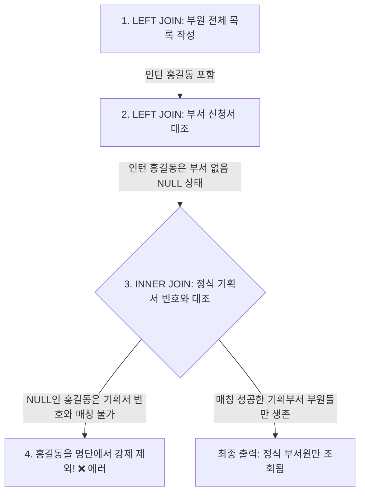

# MySQL DQL 다중 조인 및 특수 조인(Self / Cross) 가이드

본 가이드는 [join02.sql](file:///Users/morgan/Documents/workspace/260711_dql-subquery-join/join02.sql)의 다중 조인 및 튜닝 코드를 바탕으로 작성되었습니다. SQLD 자격증 취득 및 면접 대비를 위해 **DDL 및 테스트 데이터 생성 단계를 제외**하고, 오직 DQL(Data Query Language) 관점에서 **다중 조인의 데이터 유실 함정**, **셀프/크로스 조인의 원리**, **조인 전 필터링 성능 최적화 기법**을 상세히 서술합니다.

---

## 1. 🌟 초심자를 위한 비유: "동아리 부원 활동 조사와 서열 정리"

### 1) 다중 조인 LEFT ➡️ INNER 결합의 함정: "무소속 회원 실종 사건"
다중 조인을 잘못 결합하면 데이터가 강제로 삭제됩니다. 이는 **동아리 부원 명단과 부서 신청 내역을 대조하다가 발생한 행정 오류**와 같습니다.



* **원리**: 1단계에서 아무 부서가 없는 회원(NULL)까지 보존해 두었는데, 2단계에서 '정식 기획서가 있는 것만 남긴다(INNER JOIN)'라고 선언해 버리면, 기획서가 존재할 수 없는 NULL 부서원들은 대조 과정에서 탈락하여 결국 `INNER JOIN` 결과와 똑같아집니다.

---

### 2) 셀프 조인 (가계도 정리): "한 족보 책으로 부자 관계 맺기"
셀프 조인은 **가문 족보 책 한 권만 가지고, 각 인물 옆에 그 인물의 부모 정보를 매칭하여 이어붙이는 것**과 같습니다.


---

## 2. ⚙️ 주니어를 위한 원리 및 구조 설명

### 🔄 다중 조인 시 LEFT ➡️ INNER 연쇄 결합의 논리적 함정
[join02.sql:L8-17](file:///Users/morgan/Documents/workspace/260711_dql-subquery-join/join02.sql#L8-17)의 구문 오류 원인 분석입니다.

```sql
-- [데이터 누락을 유발하는 쿼리]
SELECT *
FROM employees e
LEFT JOIN employee_projects ep ON e.emp_id = ep.emp_id -- 1단계: 사원 전체 보존
INNER JOIN projects p ON ep.project_id = p.project_id; -- 2단계: 프로젝트에 참여 안 한 사원은 NULL이라서 여기서 탈락!
```

#### 💡 원리 및 대안:
1. **물리적 원리**: `LEFT JOIN`에 의해 매칭 데이터가 없는 사원은 `ep.project_id`가 `NULL`로 채워집니다. 뒤이어 `projects p`와 `INNER JOIN`을 연산할 때 `NULL = p.project_id` 조건은 **`UNKNOWN`**으로 평가되므로 조인 연산에서 탈락합니다.
2. **해결 방안**: 아웃터 조인으로 보존하고자 하는 주 데이터의 손실을 방지하려면, 뒤이어 연결되는 조인들도 연쇄적으로 **`LEFT OUTER JOIN`**으로 통일해 주어야 합니다.

---

### 🚀 조인 전 필터링 (Filter before JOIN) 최적화
[join02.sql:L53-69](file:///Users/morgan/Documents/workspace/260711_dql-subquery-join/join02.sql#L53-69)에 제시된 쿼리 최적화 튜닝 기법입니다.

```sql
-- [튜닝 후 쿼리]
SELECT *
FROM employees e
INNER JOIN (
    -- departments 테이블을 조인 전에 판교 지역으로 먼저 필터링하여 메모리 데이터 축소
    SELECT dept_id
    FROM departments
    WHERE location = '판교'
) d ON e.dept_id = d.dept_id;
```

#### 💡 옵티마이저 관점의 튜닝 원리 (Nested Loop Join):
* **일반 조인**: `departments` 테이블 전체(1,000개 부서)와 `employees` 테이블 전체를 메모리에 올려 조인 조건식을 대조한 뒤, 마지막에 판교 지역만 남기는 `WHERE location = '판교'` 연산을 처리합니다.
* **조인 전 필터링**: 조인 대상 테이블인 `departments`를 인라인 뷰를 사용해 단 5개의 '판교 소재 부서'로 먼저 줄입니다. 이렇게 필터링된 파생 테이블 `d`를 대상으로 조인($O(N)$)을 수행하므로 **루프 비교 연산 횟수가 획기적으로 감축**되어 데이터베이스 엔진 CPU 부하를 극도로 아낄 수 있습니다.

---

## 3. 🎯 SQLD 자격증 대비 핵심 이론

### 📊 특수 조인의 종류 및 개념 특징

SQLD 시험에서 다중 객체의 카테시안 연산과 자기참조 연산을 판별할 때 반드시 활용되는 핵심 지식입니다.

| 조인 유형 | 핵심 개념 및 특징 | 결과 행 수 공식 / 발생 제약 |
| :--- | :--- | :--- |
| **`CROSS JOIN`** <br> (크로스 조인) | 조건절 없이 두 테이블의 **모든 가능한 조합**을 출력하는 데카르트 곱(Cartesian Product) 연산. | $\text{행 수} = T1 \text{ 행 수} \times T2 \text{ 행 수}$ |
| **`SELF JOIN`** <br> (셀프 조인) | **동일한 하나의 테이블**을 논리적으로 두 개로 분리하여 한 컬럼이 자신의 다른 컬럼을 외래키 형태로 참조할 때 사용. | 반드시 각각 다른 테이블 별칭(Alias)을 부여해야만 컴파일 오류를 면함. |

---

## 4. 📝 면접 대비 예상 질문 & 답변 (Q&A)

### Q1. LEFT JOIN 뒤에 INNER JOIN을 연속해서 작성할 때 발생할 수 있는 문제점과 이를 해결하기 위한 설계 팁을 설명해 주세요.
**A1.**
* `LEFT JOIN`에 의해 매칭 결과가 없어 `NULL`로 채워진 행들이, 그 뒤에 이어지는 `INNER JOIN`의 조건 대조를 거치면서 강제적으로 필터링되어 탈락하게 됩니다. 이 경우 기존의 `LEFT JOIN`으로 데이터를 보존하려던 의도가 상실되어 결국 `INNER JOIN`과 같은 결과를 낳습니다.
* 이를 해결하기 위해 조인 우선순위를 명확히 규정하여 **연쇄 조인을 모두 `LEFT JOIN`으로 통일**하거나, 우선 조인될 테이블들을 **인라인 뷰 서브쿼리로 조인 완료한 뒤 최종 메인 테이블에 아웃터 조인으로 결합**해 주어야 합니다.

---

### Q2. 셀프 조인(Self Join)은 실제 현업에서 어떤 비즈니스 데이터를 핸들링할 때 주로 사용하나요?
**A2.**
테이블 구조가 **자기참조적 계층 관계(Self-Referential Hierarchy)**를 띨 때 필수적으로 사용됩니다.
대표적으로 **사원-직속관리자(조직도)** 데이터, **카테고리-상위카테고리(쇼핑몰 분류)** 데이터, **게시글-답글(대댓글)** 시스템 등 트리 구조의 순환 계층을 1차원 테이블로 표현해 둔 대상을 쿼리할 때 사용합니다.

---

### Q3. 실무에서 묵시적 조인을 하다가 CROSS JOIN(Cartesian Product) 장애를 내는 흔한 사례는 무엇인가요?
**A3.**
`FROM` 절에 `FROM employees, projects` 형태로 쉼표를 구분자로 테이블을 나열하고, 깜빡 잊고 **`WHERE` 절에 조인 조건인 `e.dept_id = d.dept_id`를 누락하는 경우**입니다.
이 경우 DBMS는 두 테이블의 모든 조합을 생성하는 카테시안 곱을 수행하여 급격한 I/O 폭발과 서버 다운을 초래합니다. 이를 예방하기 위해 묵시적 조인 대신 조인 조건 누락 시 즉시 파싱 에러를 유발하는 ANSI 표준 문법인 **`INNER JOIN ~ ON` 또는 `CROSS JOIN` 키워드**를 명시적으로 사용하는 코딩 방침이 권장됩니다.

---

## 5. 🛠️ 일반화 및 추상화된 DQL 조인 템플릿

### 1) 데이터 손실을 원천 차단하는 다중 LEFT JOIN 템플릿
```sql
SELECT
    m.[MAIN_KEY],
    m.[MAIN_COL],
    sub1.[VAL_COL_1],
    sub2.[VAL_COL_2]
FROM
    [MAIN_TABLE] AS m
LEFT JOIN
    [SUB_TABLE_1] AS sub1 ON m.[MAIN_KEY] = sub1.[MAIN_REF_KEY]
LEFT JOIN
    [SUB_TABLE_2] AS sub2 ON sub1.[SUB_KEY] = sub2.[SUB_REF_KEY]; 
    -- 2단계 조인도 LEFT JOIN으로 통일하여 sub1이 NULL인 행까지 끝까지 유실 없이 전송
```

### 2) 계층형 데이터 식별을 위한 셀프 조인 (SELF JOIN)
```sql
SELECT
    child.[NODE_ID]   AS node_id,
    child.[NODE_NAME] AS node_name,
    parent.[NODE_ID]  AS parent_id,
    parent.[NODE_NAME] AS parent_name
FROM
    [HIERARCHY_TABLE] AS child
INNER JOIN
    [HIERARCHY_TABLE] AS parent ON child.[PARENT_REF_KEY] = parent.[NODE_ID]; 
    -- 동일 테이블을 자식과 부모 역할로 쪼개어 계층 바인딩
```

### 3) 튜닝 기법: 조인 전 인라인 뷰 사전 필터링 (Filter before JOIN)
```sql
SELECT
    m.*,
    filtered_sub.*
FROM
    [MAIN_TABLE] AS m
INNER JOIN (
    -- 대용량 테이블에서 필요한 범위만 선제 필터링하여 데이터 축소
    SELECT [SUB_KEY], [SUB_COL]
    FROM [LARGE_SUB_TABLE]
    WHERE [FILTER_COL] = 'TARGET_CRITERIA'
) AS filtered_sub ON m.[MAIN_REF_KEY] = filtered_sub.[SUB_KEY];
```
