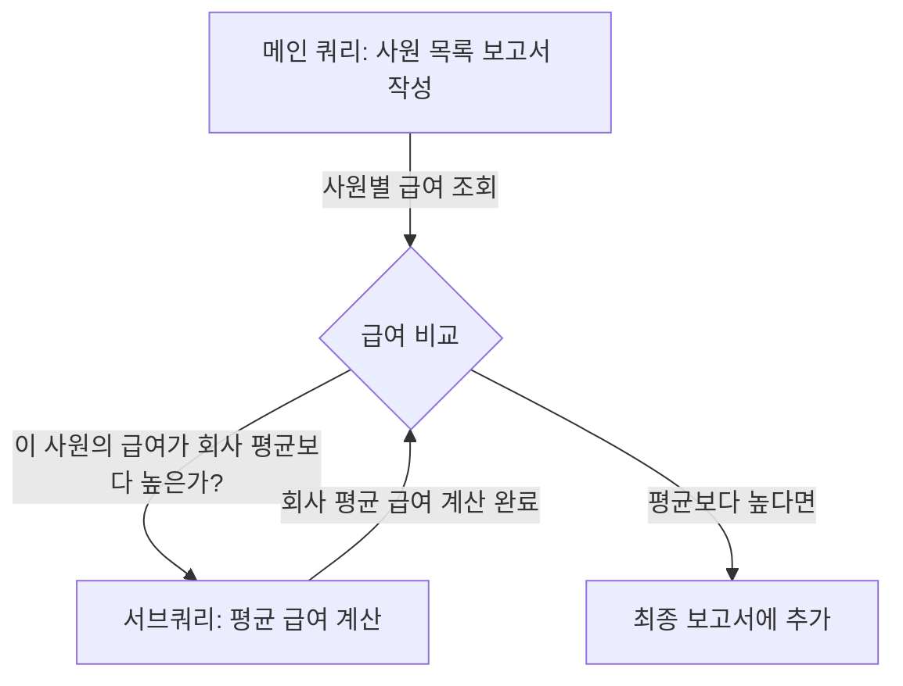
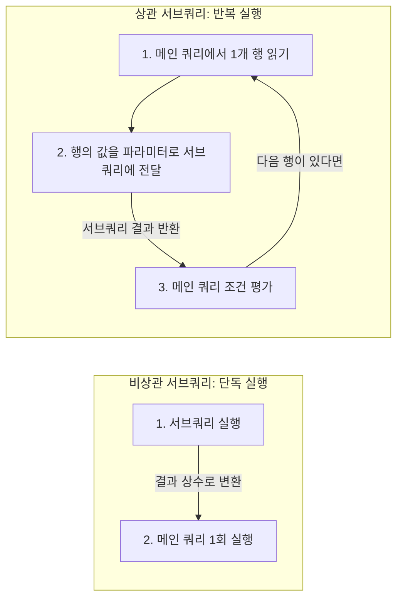

# MySQL DQL 서브쿼리(Subquery) 마스터 가이드

본 가이드는 [subquery01.sql](file:///Users/morgan/Documents/workspace/260711_dql-subquery-join/subquery01.sql)의 쿼리 예제를 바탕으로 작성되었습니다. SQLD 자격증 준비생과 주니어 개발자를 위해 **DDL 및 테스트 데이터 생성 단계를 제외**하고, 오직 DQL(Data Query Language) 중심의 서브쿼리 핵심 동작 원리와 문법을 다룹니다.

---

## 1. 🌟 초심자를 위한 비유: "종합 보고서 작성을 돕는 보조 조사원"

SQL의 서브쿼리는 **메인 보고서를 작성하다가, 중간에 필요한 특정 정보를 알아내기 위해 다른 문서를 찾아보거나 보조 조사원에게 조사를 시키는 행위**와 같습니다.



### 📁 서브쿼리 유형별 비유 표
| 서브쿼리 종류 | SQL 내 위치 | 보조 업무 비유 | 설명 |
| :--- | :--- | :--- | :--- |
| **스칼라 서브쿼리** | **SELECT 절** | 딱 한 칸의 빈칸 채우기 | 사원의 정보를 쓰다가, "이 사원의 부서명"이라는 **한 칸짜리 단어**를 알아내기 위해 부서 명부를 뒤져 부서명을 딱 하나 가져오는 것. |
| **인라인 뷰** | **FROM 절** | 임시 요약 요약지 사용 | 가공되지 않은 창고(테이블) 대신, 미리 요약되어 쌓여있는 **임시 요약 보고서 묶음**을 통째로 테이블인 양 올려두고 조회하는 것. |
| **중첩 서브쿼리** | **WHERE / HAVING 절** | 통과 기준값 알아오기 | "개발팀 최저 연봉보다 많이 받는 사람"을 찾기 위해, 먼저 개발팀 연봉 명부를 뒤져 **비교할 기준값**을 알아내는 것. |

---

## 2. ⚙️ 주니어를 위한 원리 및 구조 설명

### 🔄 연관성에 따른 서브쿼리 분류 (동작 메커니즘)

서브쿼리는 메인 쿼리와의 **상호작용(의존성) 여부**에 따라 작동하는 순서와 성능 특성이 완전히 달라집니다.



#### 1. 비상관 서브쿼리 (Uncorrelated Subquery)
* **특징**: 메인 쿼리의 컬럼을 사용하지 않고 단독으로 실행되는 서브쿼리입니다.
* **작동 원리**: 서브쿼리가 **최초 1회만 실행**되어 결과(상수값)를 메인 쿼리에 전달하고, 메인 쿼리는 이 상수값을 조건식에 대입하여 최종 필터링을 수행합니다. 성능상 유리합니다.

#### 2. 상관 서브쿼리 (Correlated Subquery)
* **특징**: 메인 쿼리의 컬럼(예: `e.dept_id`)을 서브쿼리 내부로 가져와 조건식에서 활용하는 서브쿼리입니다.
* **작동 원리**: 메인 쿼리의 **매 행(Row)이 처리될 때마다 서브쿼리가 매번 새로 실행**됩니다. 메인 쿼리의 행 개수만큼 루프(Loop)가 도는 방식이므로 데이터가 많을 경우 성능 저하의 주원인이 될 수 있습니다.

---

### 🛡️ MySQL의 인라인 뷰 Alias(별칭) 필수 제약 조건
[subquery01.sql:L179-185](file:///Users/morgan/Documents/workspace/260711_dql-subquery-join/subquery01.sql#L179-185)에 해당하는 인라인 뷰 예시입니다.

```sql
SELECT *
FROM (
    SELECT dept_id, AVG(salary) AS avg_salary
    FROM employees
    GROUP BY dept_id
) AS temp -- ⚠️ MySQL에서는 반드시 이 파생 테이블의 Alias를 지정해야 함!
WHERE avg_salary >= 5000000;
```

#### 💡 구조적 원리:
MySQL 파서(Parser)는 `FROM` 절에 서브쿼리가 올 때 이를 **파생 테이블(Derived Table)**로 규정합니다. 
SQL 문법 규칙상 물리 테이블처럼 사용하기 위해서는 메모리에 올라간 임시 데이터 묶음에 **고유한 이름(Alias)**이 명명되어야 다른 외부 조건절(`WHERE avg_salary...`)에서 해당 열을 식별하여 참조할 수 있기 때문입니다. Alias가 빠지면 `Every derived table must have its own alias` 에러를 유발합니다.

---

## 3. 🎯 SQLD 자격증 대비 핵심 이론

### 📊 반환 행수에 따른 서브쿼리 연산자 분류

SQLD 시험에서 서브쿼리 오류 판별 문항으로 가장 많이 출제되는 핵심 이론입니다.

| 서브쿼리 종류 | 반환 데이터 형태 | 사용 가능한 연산자 | 예시 상황 및 주의점 |
| :--- | :--- | :--- | :--- |
| **단일 행 서브쿼리** | 1행 1열 (단 하나의 값) | `=`, `>`, `<`, `>=`, `<=`, `!=` | `WHERE salary > (SELECT AVG(salary) FROM ...)` <br> ※ 만약 결과가 2행 이상 나오면 에러 발생. |
| **다중 행 서브쿼리** | 여러 행 1열 (값 목록) | `IN`, `ANY`, `ALL`, `EXISTS` | `WHERE salary > ANY (SELECT salary FROM ...)` <br> 단일 행 연산자(예: `=`)를 같이 쓰면 런타임 에러 발생. |

#### ⚠️ 다중 행 연산자의 내부 평가 논리
* **`IN`**: 목록 중 하나라도 **일치**하면 참.
* **`> ANY`**: 결과 목록의 **최소값(MIN)**보다 크면 참. (하나의 값에 대해서만 참이면 통과하므로)
* **`< ANY`**: 결과 목록의 **최대값(MAX)**보다 작으면 참.
* **`> ALL`**: 결과 목록의 **최대값(MAX)**보다 크면 참. (모든 값보다 커야 하므로)
* **`< ALL`**: 결과 목록의 **최소값(MIN)**보다 작으면 참.

---

## 4. 📝 면접 대비 예상 질문 & 답변 (Q&A)

### Q1. SELECT 절의 스칼라 서브쿼리와 LEFT OUTER JOIN은 기능적으로 유사한데, 성능 관점에서 어떤 차이가 있나요?
**A1.**
* **스칼라 서브쿼리**: 메인 쿼리의 각 행마다 서브쿼리가 반복 수행되므로 기본적으로 루프를 돕니다. 다만, DBMS가 서브쿼리의 입력값과 출력값을 해시 테이블에 임시 저장하는 **'서브쿼리 캐싱(Subquery Caching)'** 기능을 지원하여 중복 값이 많을 때는 성능 보완을 받습니다.
* **LEFT OUTER JOIN**: 조인 조건에 맞는 두 테이블의 데이터를 한 번에 조인 셋으로 병합한 뒤 정렬 및 스캔합니다. 데이터의 모수가 크고 중복 키 값이 적다면 대개 해시 조인(Hash Join)이나 중첩 루프 조인(NL Join)의 최적화 경로를 타는 **JOIN 방식이 성능 면에서 훨씬 우수**합니다.

---

### Q2. 다중 행 서브쿼리에서 `NOT IN` 연산자를 사용할 때 서브쿼리 반환 값에 `NULL`이 포함되어 있으면 어떤 결과가 발생하나요?
**A2.**
**결과 데이터가 아무것도 반환되지 않습니다.**
`NOT IN (A, B, NULL)`은 논리적으로 `(col != A) AND (col != B) AND (col != NULL)`로 변환됩니다. 
SQL의 삼치 논리에 의해 `col != NULL`은 항상 `UNKNOWN`으로 평가되며, `AND` 연산에서 하나라도 `UNKNOWN`이 섞이면 전체 조건식 평가 결과가 최종적으로 `TRUE`가 될 수 없습니다. 따라서 결과 집합은 공집합(Empty Set)이 됩니다. 이를 막기 위해 서브쿼리 내부에 `WHERE col IS NOT NULL`을 명시해야 합니다.

---

### Q3. HAVING 절에서 서브쿼리를 사용할 수 있는 조건이나 주의점은 무엇인가요?
**A3.**
`HAVING` 절은 `GROUP BY`를 통해 그룹화된 데이터 집합에 대한 필터링을 수행합니다. 
따라서 `HAVING` 절 안에 배치되는 서브쿼리는 대개 메인 쿼리의 그룹화 기준이나 그룹 집계 결과(`AVG(salary)` 등)와 비교할 수 있도록 작성되어야 합니다. 또한, `HAVING` 절의 조건식에서 단일 값과의 비교가 필요할 때는 서브쿼리 역시 단일 값을 반환하는 스칼라 또는 단일 행 집계 서브쿼리여야만 연산 오류가 나지 않습니다.

---

## 5. 🛠️ 일반화 및 추상화된 서브쿼리 DQL 템플릿

### 1) SELECT 절 스칼라 서브쿼리 (상관)
```sql
SELECT
    m.[MAIN_KEY],
    m.[MAIN_COL],
    (SELECT s.[SUB_VAL]
     FROM [SUB_TABLE] AS s
     WHERE s.[SUB_KEY] = m.[MAIN_REF_KEY] -- 상관 관계 바인딩
    ) AS detail_value
FROM
    [MAIN_TABLE] AS m;
```

### 2) FROM 절 인라인 뷰 (비상관)
```sql
SELECT
    temp.[GROUP_KEY],
    temp.aggregated_value
FROM (
    SELECT
        [GROUP_COL] AS [GROUP_KEY],
        AVG([VAL_COL]) AS aggregated_value
    FROM [TARGET_TABLE]
    GROUP BY [GROUP_COL]
) AS temp -- MySQL 필수 가상 테이블 별칭
WHERE
    temp.aggregated_value > 50000;
```

### 3) WHERE 절 다중 행 서브쿼리 (비상관)
```sql
SELECT
    m.*
FROM
    [MAIN_TABLE] AS m
WHERE
    m.[COMPARE_COL] > ALL (
        SELECT s.[VAL_COL]
        FROM [SUB_TABLE] AS s
        WHERE s.[CONDITION_COL] = 'FILTER_CRITERIA'
    ); -- 결과 목록 중 최대값보다 큰 행들만 추출
```
