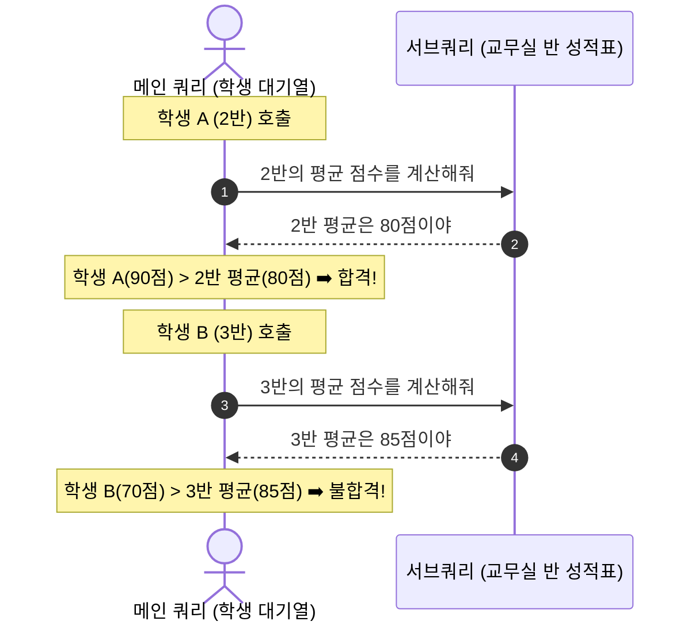
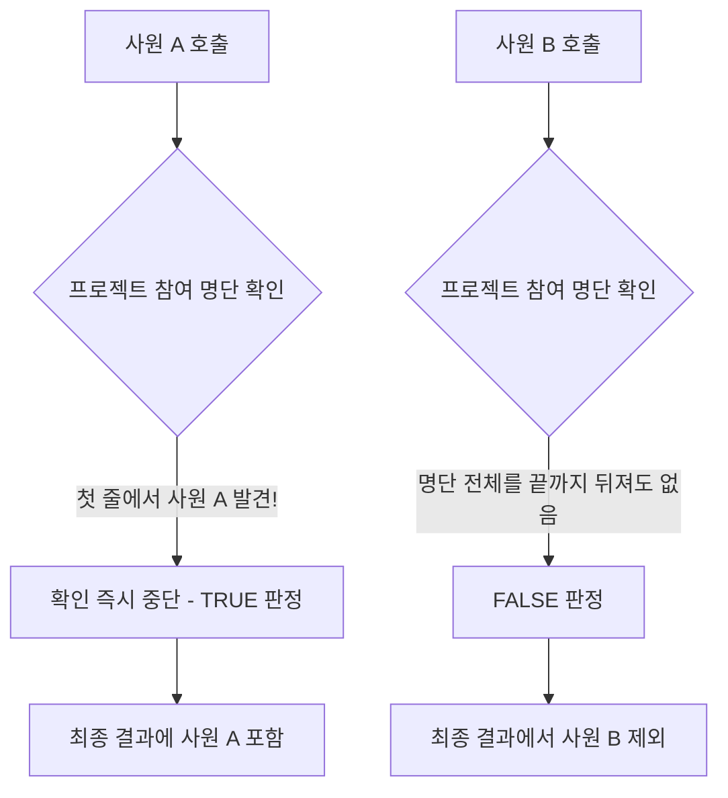

# MySQL DQL 상관 서브쿼리 및 EXISTS 가이드

본 가이드는 [subquery02.sql](file:///Users/morgan/Documents/workspace/260711_dql-subquery-join/subquery02.sql)의 상관 관계 분석 코드를 바탕으로 작성되었습니다. SQLD 자격증 취득 및 기술 면접 대비를 위해 **DDL 및 테스트 데이터 생성 단계를 제외**하고, 오직 DQL(Data Query Language) 중심의 **상관 서브쿼리(Correlated Subquery)**와 **존재 판별 연산자(`EXISTS`, `NOT EXISTS`)**의 동작 메커니즘을 규명합니다.

---

## 1. 🌟 초심자를 위한 비유: "반 평균 비교와 출석 확인"

### 1) 상관 서브쿼리: "너희 반 평균 점수 알아와!"
메인 쿼리가 데이터를 훑으면서 서브쿼리에 '매개변수'를 전달하는 방식은 **학생들을 한 명씩 불러 세워 본인 반의 평균을 알아오게 한 뒤 비교하는 것**과 같습니다.



---

### 2) EXISTS (존재 판별): "축제 신청 명단에 이름이 한 번이라도 있니?"
`EXISTS`는 값이 일치하는지 전부 비교하는 것이 아니라, **단 한 번이라도 흔적이 존재하는가**만 판별합니다.



---

## 2. ⚙️ 주니어를 위한 원리 및 구조 설명

### 🔄 EXISTS의 조기 종료 (Short-Circuit Evaluation) 메커니즘
`EXISTS` 연산자가 대용량 데이터에서 성능적 우위를 점하는 가장 큰 이유는 **조기 종료(Short-Circuit)** 특성 때문입니다.

- **동작 방식**: 메인 쿼리의 특정 행에 대해 서브쿼리를 실행할 때, 조건에 만족하는 레코드를 **단 1개라도 발견하는 즉시** 추가 스캔을 중단하고 즉각 `TRUE`를 반환합니다.
- 반면 `IN` 연산자는 서브쿼리의 모든 행을 풀 스캔하여 결과 집합을 메모리에 먼저 구축(Materialization)해야 하므로 메모리와 CPU 비용이 상대적으로 더 큽니다.

---

### 🔍 `SELECT 1` vs `SELECT *` 관습과 최적화의 진실
[subquery02.sql:L57-68](file:///Users/morgan/Documents/workspace/260711_dql-subquery-join/subquery02.sql#L57-68)에서는 `SELECT *` 대신 `SELECT 1`을 사용하는 쿼리가 명시되어 있습니다.

```sql
-- 1) 고전적/관습적 형태
SELECT * FROM employees e
WHERE EXISTS (
    SELECT 1 FROM employee_projects ep 
    WHERE ep.emp_id = e.emp_id
);
```

#### 💡 원리 분석:
1. **과거의 이유**: 과거 구형 데이터베이스 엔진에서는 `SELECT *`를 사용하면 서브쿼리가 해당 테이블의 모든 컬럼 값을 메모리 영역에 로드하려 시도했기 때문에, 성능 부하를 줄이고자 단순 상수인 `SELECT 1`을 강제해 사용했습니다.
2. **현대 옵티마이저의 동작**: 현대의 MySQL(InnoDB 엔진)을 비롯한 대부분의 RDBMS 옵티마이저는 `EXISTS` 내부의 `SELECT` 구문을 분석할 때 **SELECT 절에 기술된 대상이 무엇이든 상관하지 않고 오직 조건 만족 여부(TRUE/FALSE)만 판별하도록 쿼리 실행 계획을 자동으로 단순화**합니다. 즉, `SELECT 1`, `SELECT *`, `SELECT NULL` 모두 동일하게 최적화된 기계어로 번역되어 성능적 차이가 전혀 없습니다.
3. **권장 사항**: 현대에는 성능 차이가 없지만, 코드의 가독성과 "존재 여부만 확인한다"는 의도를 명확히 전달하기 위해 여전히 `SELECT 1`을 업계 관습(Best Practice)으로 널리 사용합니다.

---

## 3. 🎯 SQLD 자격증 대비 핵심 이론

### 🆚 EXISTS vs IN 연산자 성능 특징 비교

SQLD 시험의 단골 비교 문제입니다. 데이터의 특성과 크기에 따라 알맞은 연산자를 판별해야 합니다.

| 비교 항목 | `EXISTS` | `IN` |
| :--- | :--- | :--- |
| **평가 메커니즘** | 메인 쿼리 로우마다 서브쿼리 존재 여부를 판별 (상관 서브쿼리 연계) | 서브쿼리 결과 집합을 메모리에 올린 후 메인 쿼리와 비교 (비상관 가능) |
| **최적 상황** | **서브쿼리 테이블이 매우 크고**, 메인 쿼리 테이블이 상대적으로 작을 때 유리 | **메인 쿼리 테이블이 매우 크고**, 서브쿼리 테이블 결과가 작을 때 유리 |
| **동작 특징** | 조건 만족 레코드를 찾는 즉시 종료 (Short-Circuit) | 서브쿼리 결과의 중복을 제거(Unique화)하는 추가 비용 발생 가능 |

---

### ⚠️ NOT IN vs NOT EXISTS의 NULL 처리 함정 (필수 암기)

SQLD 시험에서 가장 정답률이 낮고 헷갈리는 함정 논리입니다.

* **`NOT IN`**: 서브쿼리 결과 리스트에 **단 하나의 `NULL`이라도 포함되어 있다면**, 전체 비교식 결과가 항상 `UNKNOWN`이 되어 **최종적으로 아무 결과도 조회되지 않습니다.**
* **`NOT EXISTS`**: 메인 쿼리와 서브쿼리의 조인 조건(`ep.emp_id = e.emp_id`)을 타기 때문에, 서브쿼리 내에 NULL 값이 존재하더라도 메인 쿼리의 실제 값과 매핑되지 않을 뿐(`FALSE` 평가), **나머지 NULL이 아닌 행들에 대해서는 정상적인 TRUE/FALSE 결과를 도출**해 냅니다. 따라서 실무에서 존재하지 않는 데이터를 찾을 때는 `NOT EXISTS`가 안전한 선택으로 권장됩니다.

---

## 4. 📝 면접 대비 예상 질문 & 답변 (Q&A)

### Q1. EXISTS와 IN 연산자의 내부 실행 방식의 차이를 설명해 주세요.
**A1.**
* `IN` 연산자는 주로 서브쿼리가 독자적으로 실행되어 결과 집합을 임시 테이블(뷰)로 만들고, 이를 메인 테이블과 조인하는 방식으로 동작합니다.
* `EXISTS` 연산자는 메인 쿼리의 각 행에서 추출한 값을 서브쿼리의 조건절에 바인딩하여, 조건에 부합하는 레코드가 최소 1개 이상 존재하는지 여부를 판단합니다. 단 하나의 행이라도 발견되면 즉시 탐색을 종료하는 Short-Circuit 방식으로 처리됩니다.

---

### Q2. 실무에서 상관 서브쿼리를 작성할 때 성능 저하를 방지하기 위해 고려해야 할 사항은 무엇인가요?
**A2.**
상관 서브쿼리는 메인 쿼리의 모든 레코드에 대해 서브쿼리가 반복 실행되므로 메인 쿼리 건수($N$)에 비례하여 서브쿼리 실행 횟수가 결정됩니다. 
성능 저하를 막기 위해서는 서브쿼리 내부에서 필터로 사용되는 컬럼(예: `dept_id`, `emp_id`)에 **반드시 인덱스(Index)가 생성**되어 있어야 합니다. 인덱스가 없다면 매 루프마다 서브쿼리 테이블 전체를 풀 스캔하므로 시스템 장애를 유발할 수 있습니다. 필요한 경우 `JOIN` 형태로 쿼리를 튜닝하여 1회 스캔으로 끝내야 합니다.

---

### Q3. NOT EXISTS와 NOT IN의 차이점을 NULL 데이터 관점에서 설명해 주세요.
**A3.**
`NOT IN` 연산자는 서브쿼리의 반환 결과에 `NULL`이 하나라도 포함되면 비교 대상 행들이 전부 `UNKNOWN` 논리로 귀결되어 아무 행도 출력되지 않는 버그성 결과가 발생합니다. 
반면 `NOT EXISTS`는 상관 관계 비교 형식을 띄기 때문에 서브쿼리의 특정 값이 NULL이더라도 메인 쿼리의 값과 매치되지 않는 논리로만 정상 처리되어, NULL 데이터 유무에 구애받지 않고 안전하게 조회가 가능합니다.

---

## 5. 🛠️ 일반화 및 추상화된 상관/존재판별 DQL 템플릿

### 1) 그룹별 평균(집계값)보다 큰 레코드 검출 (상관 서브쿼리)
```sql
SELECT
    m.*
FROM
    [MAIN_TABLE] AS m
WHERE
    m.[COMPARE_COL] > (
        SELECT AVG(sub.[COMPARE_COL])
        FROM [MAIN_TABLE] AS sub
        WHERE sub.[GROUP_COL] = m.[GROUP_COL] -- 메인 쿼리의 그룹 컬럼과 바인딩
    );
```

### 2) 관계 이력이 존재하는 행 조회 (EXISTS)
```sql
SELECT
    m.*
FROM
    [MAIN_TABLE] AS m
WHERE EXISTS (
    SELECT 1
    FROM [MAPPING_TABLE] AS map
    WHERE map.[MAIN_REF_KEY] = m.[MAIN_KEY] -- 조인 조건 만족 시 즉시 TRUE 반환 후 조기종료
);
```

### 3) 이력이 존재하지 않는 행 조회 (NOT EXISTS)
```sql
SELECT
    m.*
FROM
    [MAIN_TABLE] AS m
WHERE NOT EXISTS (
    SELECT 1
    FROM [MAPPING_TABLE] AS map
    WHERE map.[MAIN_REF_KEY] = m.[MAIN_KEY]
);
```
